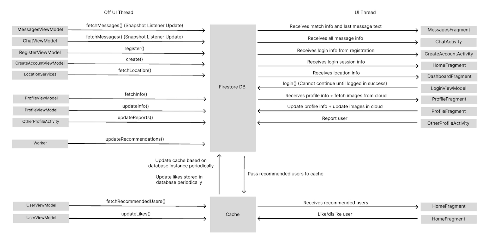

# CMPT 362 Group 23 - MatchMakers App

Source code located in master branch

MatchMakers is an app for users looking to make connections with like-minded people. Through matchmakers, users are able to connect with others who share similar interests, goals, or values. Whether you're looking for friends, collaborators, or something more, MatchMakers provides a platform tailored to fostering meaningful relationships.Through personalized matching algorithms and a focus on shared passions, the app ensures users are introduced to people who truly resonate with their interests.
## Important Links

| [Pitch](https://www.youtube.com/watch?v=2PVG1jqdfvM) | [Show_and_tell_1](https://www.youtube.com/watch?v=h-Vs2XWP1j8) | [Show_and_tell_2](https://youtu.be/gWE3jOryKNg) | [Final Presentation]() | [Website]() |
|-----------|---------------|---------------------|------------------------|-------------|

## Table of Contents
1. [Threads Diagram](#threads)

2. [Special Instructions](#instructions)

3. [Guidance](#guide)

## 1. Threads Diagram

## 2. Special Instructions
To test matching: 
Email: cmpt362_marking@email.com Pass: 123456
This account has been marked as "liked" by every user in our database, allowing for testing of the matching and inbox creation.

To test messaging: 
Email: testhome4324@gmail.com Pass: 123456
Email: testercreate123@gmail.com Pass: 123456
These two users share an inbox between eachother to test real-time chat.

## 3. Guidance

- Use [Github](https://)
- Use [Android Studio](https://developer.android.com/studio?gad_source=1&gclid=CjwKCAiA0rW6BhAcEiwAQH28In7LMm4q69rR5m_n4rEX8QFKPQq8o0bS8W_h1UhVGPK1rZM1ZUfzExoCAZoQAvD_BwE&gclsrc=aw.ds)
- Use [Firebase](https://console.firebase.google.com/)
